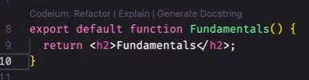
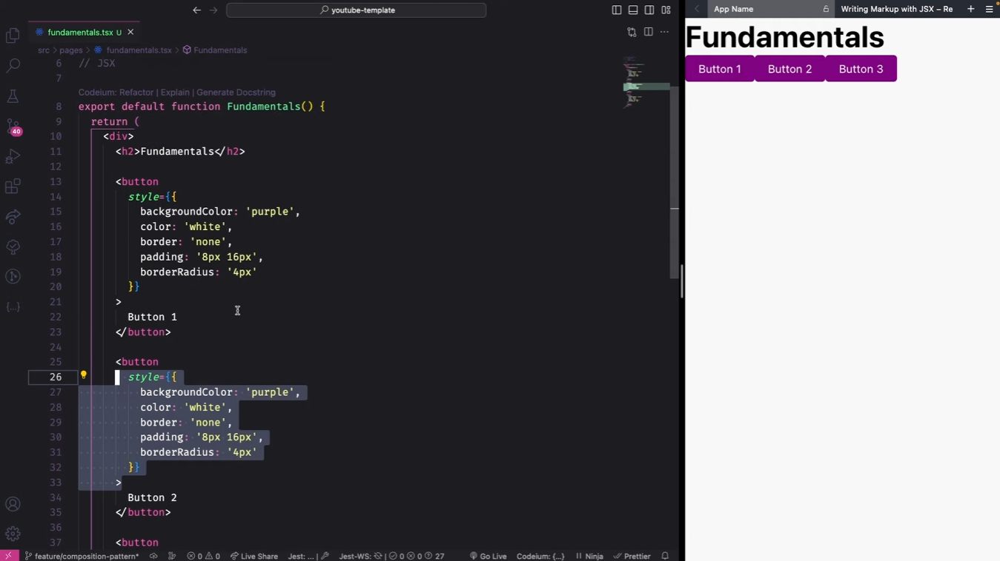
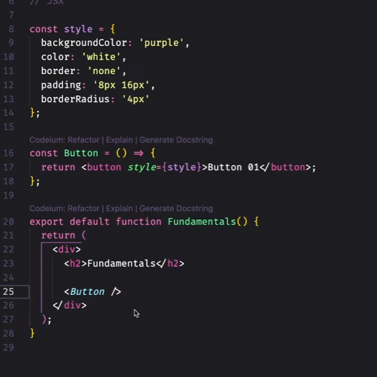
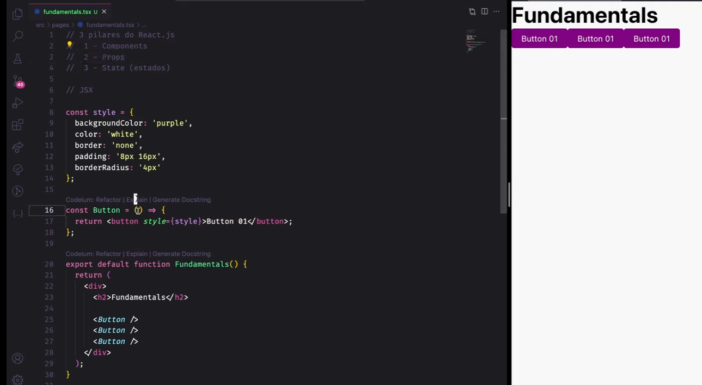
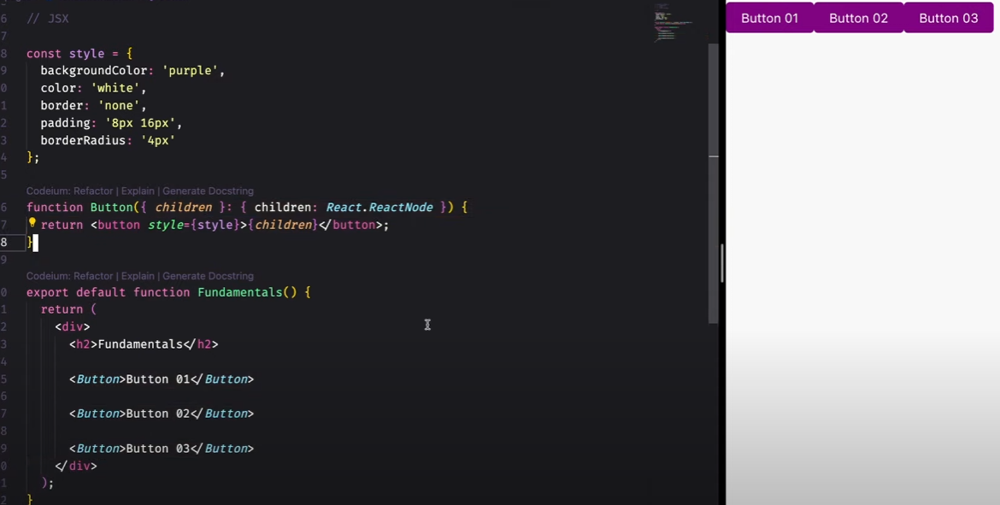
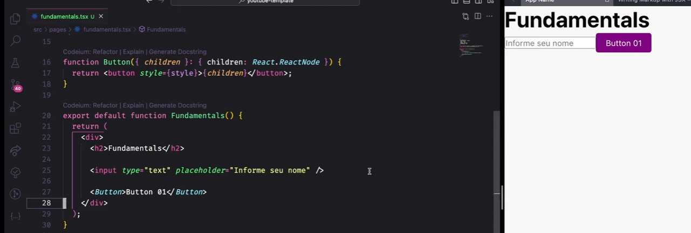
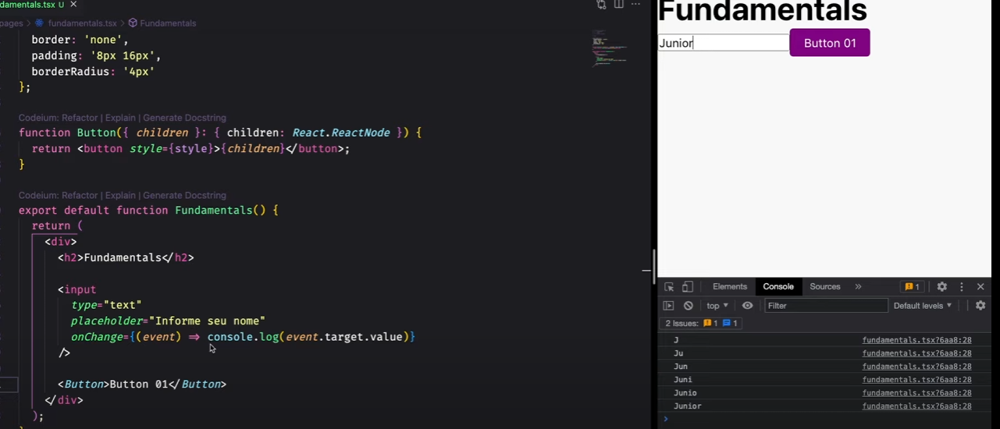
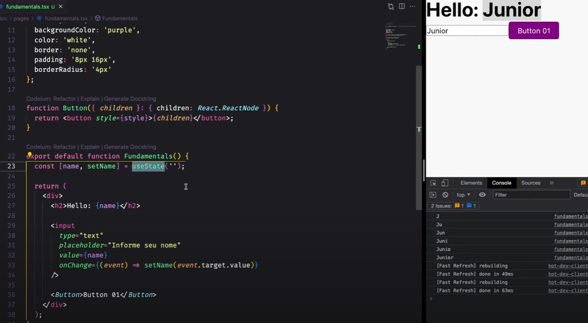

# 3 Conceitos React que você precisa dominar!

Link: https://youtu.be/3Jg4tsebuTg?list=PLzILwKck99iar3MQeGw3W_MoMlVBYhrCY

Complementar: https://horadecodar.com.br/como-pegar-valor-de-input-com-react-js/

DOC: https://react.dev/learn/writing-markup-with-jsx

Pilares do React.js:

1. Components;
2. Props;
3. State (estados);

Antes de tudo, React utiliza JSX (Javascript + XML), que é uma sintaxe que estende o Javascript.

Ele nos permite escrever HTML dentro do JS.

Da pra usar a extensão TSX também, que se refere ao Typescript.

Ou seja, um **Componente** nada mais é que uma **função que retorna JSX/TSX.**



1. Conceito: **COMPONENTS**

Exemplo: Preciso de vários botões sendo retornados dentro da função, porém fica inviável repetir o código.



Resposta: Componentizar tanto a estilização quanto a estrutura, tornando o código mais legível e funcional.



2. Conceito: **PROPS**

Problema: Porém há uma necessidade de passar um **children independente**, pra cada um dos componentes, vem o segundo conceito.



**Props** são os **parâmetros** da nossa função. 

Resposta: No exemplo, **children** é passado como parâmetro de Button.

E no **return**, ele é acessado através das **chaves { }**, que é a forma de passar uma variável javascript para dentro de um HTML.



3. Conceito: **"STATES (ESTADOS)"**

Problema: 
1. Além disso, e se a gente precisasse pedir alguma informação do usuário?
2. E como eu recupero essas informações?
3. E como é que eu salvo isso e atualizo a minha página?

Resposta:
1. Criar um Input.



2. Usando o evento onChange, que no React, detecta quando o valor de um elemento de entrada muda.



3. Usando o React Hook, **useState**. Pois é ele quem **gerencia os states (estados)** do componente.



No exemplo, a primeira posição passada é o **state** (**"name**"), que é o valor inicial do input e o **"setName"** é a função que **está atualizando** o state (**"name**").

O atributo **value** é o responsável por:
- Definir ou obter o valor atualmente inserido ou selecionado pelo usuário. 

Então o value em questão é o "name", já que ele é o valor inicial do input que queremos observar.

Quando o usuário altera o valor do input, o evento **onChange** é disparado e o **setName** pega esse valor "(event.target.value)" e altera o state.

Daria para passar o setName numa função chamada "handleChange" também.

Exemplo: 
```javascript
const [name, setName] = useState('');

const handleChange = (event) => {
  setName(event.target.value);
};

return (
  <input type="text" value={name} onChange={handleChange} />
);
```